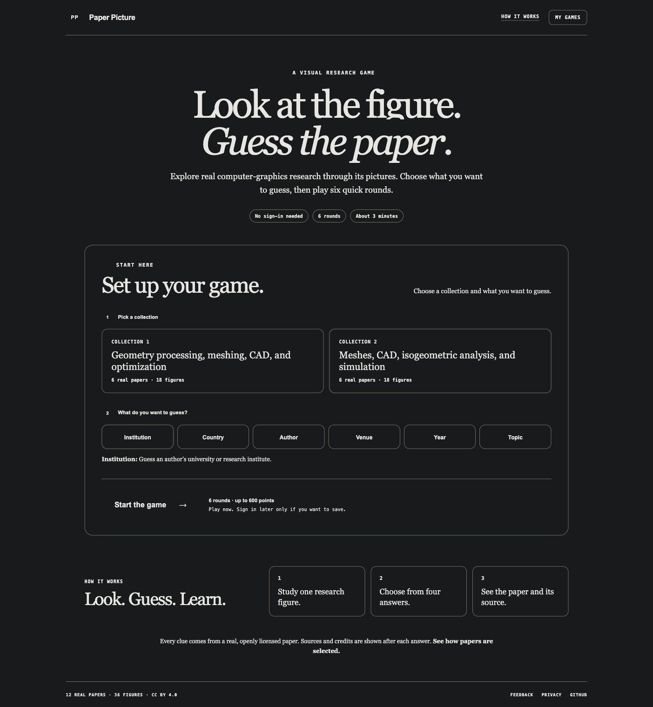
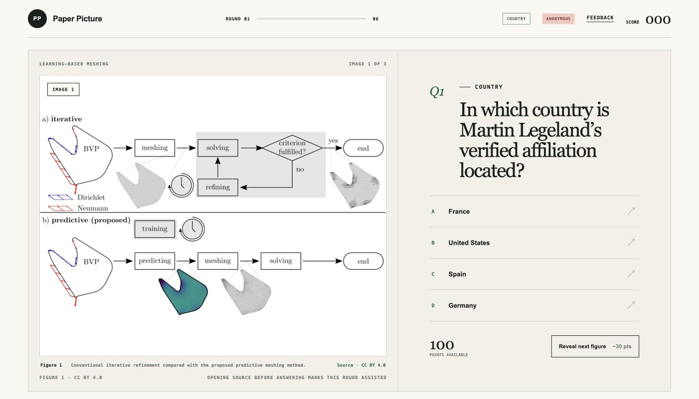
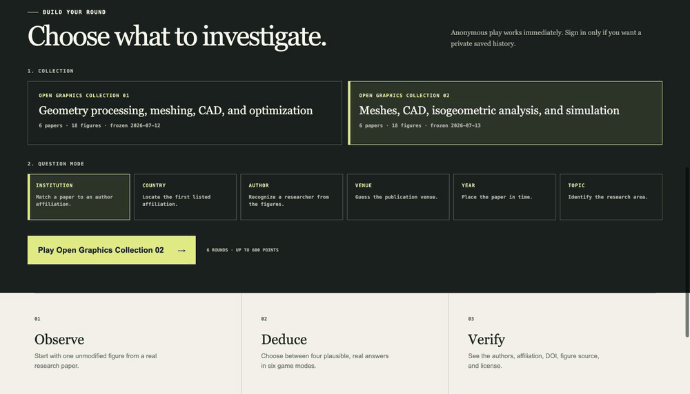
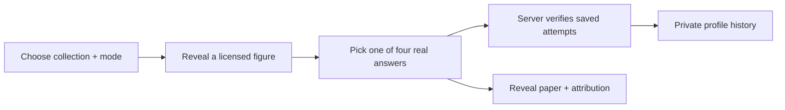

# Paper Picture

[Paper Picture](https://paperpicture.net) is a visual research game: players study progressively revealed figures from real computer-graphics and digital-geometry papers, then identify an author, institution, country, venue, year, or topic.

Every playable figure has a publisher source, article-level reuse evidence, a figure-credit review, descriptive alternative text, and a recorded SHA-256 checksum. The application contains no fictional papers, authors, or affiliations.



## Live release

- Website: <https://paperpicture.net>
- Content: 2 immutable collections, 12 papers, and 36 figures
- Modes: institution, country, author, venue, year, and topic
- Play: anonymous by default; sign in only to save private history or send feedback
- Figure rights: CC BY 4.0 article coverage plus a selected-figure credit check
- Hosting: OpenAI Sites, Cloudflare Workers-compatible vinext output, and D1

Collection 01’s paper records, figure assets, and rights evidence remain unchanged. Collection 02 is a separately versioned, rights-reviewed release, so existing saved games keep their original context.





## Product features

- One-, two-, and three-figure progressive reveal
- Deterministic four-option questions across six game modes
- Server-recalculated scores of 100, 70, or 40 points
- Assisted-round marking when a figure source is opened before answering
- Full paper, author, affiliation, DOI, figure-source, and license reveal
- Private profiles, saved game history, display-name editing, and complete deletion
- Authenticated feedback with an owner-only triage and CSV-export inbox
- Owner-only seven-day operational totals using aggregate hourly counters
- No advertising analytics, public profiles, leaderboard, or cross-site tracking
- Versioned rights evidence with automated image-hash verification
- Responsive, keyboard-focused UI with reduced-motion support

## How it works



The full system and trust-boundary diagram is in [Architecture](docs/ARCHITECTURE.md).

## Technology

- Next.js-compatible app routes rendered by [vinext](https://github.com/cloudflare/vinext)
- React 19 and TypeScript
- Cloudflare Workers runtime
- Cloudflare D1 with Drizzle schema and migrations
- OpenAI Sites hosting, native ChatGPT identity headers, and portable Auth.js OAuth

## Local development

Prerequisite: Node.js `>=22.13.0`.

```bash
npm install
npm run dev
```

Release checks:

```bash
npm test
npm run lint
npm run typecheck
git diff --check
```

Local anonymous play works without a database. Authenticated profile, saved-game, feedback, metrics, and owner flows require runtime bindings that mirror production:

- `DB`: logical D1 binding declared in `.openai/hosting.json`
- `PROFILE_ID_SECRET`: HMAC secret used to derive pseudonymous player keys
- `ADMIN_EMAIL`: owner identity allowed to review feedback and operational totals
- `AUTH_SECRET`: Auth.js cookie and token signing secret
- `AUTH_GOOGLE_ID` / `AUTH_GOOGLE_SECRET`: Google OAuth application credentials
- `AUTH_GITHUB_ID` / `AUTH_GITHUB_SECRET`: GitHub OAuth application credentials

Production values are managed by the hosting control plane and must never be committed.

## Repository map

- `app/`: game UI, pages, authenticated APIs, profile service, and owner inbox
- `data/papers.ts`: Collection 01, collection registry, and mode question builder
- `data/open-graphics-02.ts`: immutable Collection 02 records
- `data/rights-evidence*.json`: machine-readable source evidence and asset hashes
- `data/RIGHTS_AUDIT*.md`: human-reviewed inclusion records
- `db/schema.ts` and `drizzle/`: D1 model and generated migrations
- `public/papers/`: approved, publisher-provided figures
- `tests/rendered-html.test.mjs`: release, privacy, collection, and rights invariants

## Documentation

- [Architecture and data boundaries](docs/ARCHITECTURE.md)
- [Authentication setup and provider callbacks](docs/AUTH_SETUP.md)
- [Current status and handoff](PROJECT_STATUS.md)
- [13 July 2026 release worklog](docs/WORKLOG_2026-07-13.md)
- [Operations, backup, and rollback](OPERATIONS.md)
- [Public test checklist](PUBLIC_TEST_CHECKLIST.md)
- [Prioritized roadmap](ROADMAP.md)
- [Collection 01 rights audit](data/RIGHTS_AUDIT.md)
- [Collection 02 rights audit](data/RIGHTS_AUDIT_02.md)
- [Repository and figure rights](LICENSE.md)

## Safety and contribution rules

- Never commit production exports, feedback text, raw emails, secrets, browser data, registrar credentials, or source-write credentials.
- Never edit a frozen collection in place. Content or answer changes require a new collection ID and version.
- Never add a figure without explicit license evidence, a separate-credit review, attribution, alternative text, and an updated checksum.
- Keep profiles private unless a separate consent, moderation, and abuse-prevention design is approved.

This is a public portfolio repository, but no open-source license is currently granted for the original Paper Picture code, visual design, or documentation. See [LICENSE.md](LICENSE.md). Third-party research figures retain their recorded CC BY 4.0 terms.
