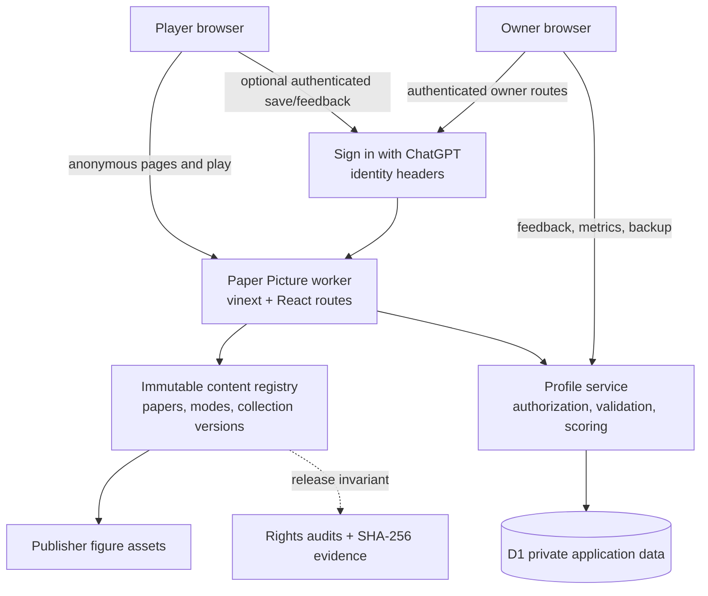
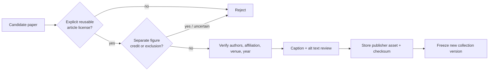

# Paper Picture architecture

## System view

## Trust and privacy boundaries

- Anonymous play runs entirely from public, immutable collection data. A failed save request does not block the game.
- Authenticated APIs derive a pseudonymous player key with HMAC-SHA256. Raw email and access tokens are not written to gameplay tables.
- The service recalculates saved answers and scores from the immutable collection; the browser’s claimed score is never trusted.
- Owner APIs require both an authenticated identity and an exact configured owner email. Non-owners receive a not-found response.
- D1 stores profiles, games, attempts, feedback, short-lived rate limits, and aggregate event counters.
- Operational counters have only an event name, hourly bucket, and count. They do not contain a user, IP, URL, paper, or message field.
- Public health data is generated from the content registry and never queries player tables.

## Content boundary

Each collection is independently versioned and fails closed: only papers and figures marked `approved`, with sufficient figures and matching evidence, become playable. Release tests verify the IDs, expected asset count, license records, and exact SHA-256 hashes.

## Request paths

| Path | Identity | Data touched |
| --- | --- | --- |
| `/`, `/privacy`, `/test-guide`, `/api/health` | None | Public collection metadata only |
| `/api/game-sessions*`, `/api/profile`, `/api/feedback` | Player | That player’s pseudonymous rows |
| `/admin/feedback`, `/api/admin/feedback`, `/api/admin/metrics`, `/api/admin/backup` | Owner | Owner-authorized private operational data |

## Deployment

The repository builds a Cloudflare Workers-compatible bundle through vinext. OpenAI Sites owns the production project, D1 binding, environment values, saved deployment versions, custom-domain routing, and managed certificate. Generated Drizzle migrations are committed with the code that uses them.
